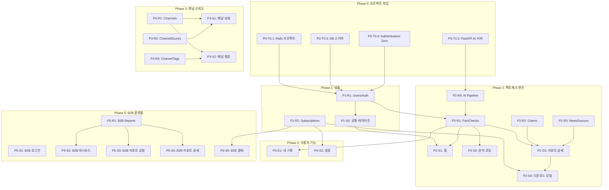

# TASKS.md — Factis

> 유튜브 시사/뉴스 채널 AI 팩트체크 플랫폼
> Domain-Guarded 모드 | 화면 명세 기반 생성

---

## MVP 캡슐

1. **목표**: 유튜브 시사/뉴스 채널의 주장을 빅카인즈 뉴스 빅데이터로 AI 팩트체크
2. **페르소나**: 시사 뉴스를 즐겨보는 시민
3. **핵심 기능**: AI 팩트체크 엔진, 채널 신뢰도 평가, B2B 광고적합성 리포트
4. **기술 스택**: Ruby on Rails + FastAPI + PostgreSQL + pgvector

---

## Interface Contract Validation

```
✅ PASSED — Coverage: 100%

Resource        │ Fields Used │ Screens Using
────────────────┼─────────────┼──────────────────────────────
users           │ 4/5         │ auth, settings, b2b-auth
fact_checks     │ 9/9         │ home, analyze, report, history, channel
claims          │ 7/7         │ report-detail
news_sources    │ 7/7         │ report-detail
channels        │ 9/9         │ home, report, channel, ranking, b2b-report
channel_scores  │ 5/5         │ channel-detail
channel_tags    │ 1/1         │ ranking
subscriptions   │ 6/6         │ report, download, settings, b2b-dashboard, billing
b2b_reports     │ 10/10       │ b2b-dashboard, b2b-report-new, b2b-report-detail
```

---

## 의존성 그래프



---

## Phase 0: 프로젝트 셋업

### [ ] P0-T0.1: Rails 프로젝트 초기화
- **담당**: backend-specialist
- **스펙**: Ruby on Rails 프로젝트 생성 (API 모드 + 뷰 포함), 기본 Gem 설정 (pg, authentication-zero, jbuilder)
- **파일**: `Gemfile`, `config/database.yml`, `config/routes.rb`
- **완료 조건**: `rails server` 정상 기동

### [ ] P0-T0.2: FastAPI AI 서버 초기화
- **담당**: backend-specialist
- **스펙**: FastAPI 프로젝트 생성 (ai_server/), 의존성 설정 (openai, whisper, yt-dlp, httpx)
- **파일**: `ai_server/main.py`, `ai_server/requirements.txt`
- **완료 조건**: `uvicorn` 정상 기동, `/health` 엔드포인트 응답

### [ ] P0-T0.3: DB 스키마 마이그레이션
- **담당**: database-specialist
- **스펙**: PostgreSQL DB 생성, pgvector 확장 설치, 9개 테이블 마이그레이션 (users, fact_checks, claims, news_sources, channels, channel_scores, channel_tags, subscriptions, b2b_reports)
- **파일**: `db/migrate/*.rb`
- **참조**: `docs/planning/04-database-design.md`
- **완료 조건**: `rails db:migrate` 성공, 모든 테이블 존재

### [ ] P0-T0.4: Authentication Zero 설정
- **담당**: backend-specialist
- **스펙**: authentication-zero gem 설치 + Email OTP 인증 플로우 구현
- **파일**: `app/controllers/sessions_controller.rb`, `app/models/user.rb`
- **의존**: P0-T0.1, P0-T0.3
- **완료 조건**: 이메일 OTP 발송/검증 플로우 동작

---

## Phase 1: 공통 리소스 + 레이아웃

### P1-R1: Users/Auth Resource

#### [ ] P1-R1-T1: Users/Auth API 구현
- **담당**: backend-specialist
- **리소스**: users
- **엔드포인트**:
  - POST /api/auth/request_otp (OTP 발송)
  - POST /api/auth/verify_otp (OTP 검증 → 로그인/회원가입)
  - DELETE /api/auth/logout (로그아웃)
  - GET /api/users/me (현재 사용자 정보)
- **필드**: id, email, name, user_type, created_at
- **파일**: `test/controllers/api/auth_controller_test.rb` → `app/controllers/api/auth_controller.rb`
- **Worktree**: `worktree/phase-1-common`
- **TDD**: RED → GREEN → REFACTOR

### P1-R2: Subscriptions Resource

#### [ ] P1-R2-T1: Subscriptions API 구현
- **담당**: backend-specialist
- **리소스**: subscriptions
- **엔드포인트**:
  - GET /api/subscriptions/current (현재 구독 상태)
  - POST /api/subscriptions (구독 생성)
  - PUT /api/subscriptions/:id (구독 변경)
  - DELETE /api/subscriptions/:id (구독 취소)
- **필드**: id, user_id, plan_type, status, started_at, expires_at, payment_method
- **파일**: `test/controllers/api/subscriptions_controller_test.rb` → `app/controllers/api/subscriptions_controller.rb`
- **Worktree**: `worktree/phase-1-common`
- **TDD**: RED → GREEN → REFACTOR
- **병렬**: P1-R1-T1과 병렬 가능

### P1-S0: 공통 레이아웃

#### [ ] P1-S0-T1: 공통 레이아웃 UI 구현
- **담당**: frontend-specialist
- **화면**: 공통 (모든 페이지에 적용)
- **컴포넌트**:
  - WebTopNav (상단 네비게이션 — 로고, 메뉴, 알림, 프로필)
  - MobileBottomNav (하단 탭 — 홈/랭킹/내기록/설정)
  - ResponsiveLayout (반응형 래퍼)
- **파일**: `test/system/layouts_test.rb` → `app/views/layouts/application.html.erb`, `app/javascript/components/`
- **Worktree**: `worktree/phase-1-common`
- **TDD**: RED → GREEN → REFACTOR
- **의존**: P1-R1-T1
- **참조**: `design/screens/web-home.png`, `design/screens/b2c-home.png`

---

## Phase 2: 팩트체크 엔진 (핵심 기능)

### P2-R1: FactChecks Resource

#### [ ] P2-R1-T1: FactChecks API 구현
- **담당**: backend-specialist
- **리소스**: fact_checks
- **엔드포인트**:
  - POST /api/fact_checks (팩트체크 요청 생성)
  - GET /api/fact_checks/:id (팩트체크 상태/결과 조회)
  - GET /api/fact_checks (내 팩트체크 목록)
- **필드**: id, user_id, channel_id, youtube_video_id, youtube_url, video_title, video_thumbnail, transcript, summary, overall_score, analysis_detail, status, created_at, completed_at
- **파일**: `test/controllers/api/fact_checks_controller_test.rb` → `app/controllers/api/fact_checks_controller.rb`
- **Worktree**: `worktree/phase-2-factcheck`
- **TDD**: RED → GREEN → REFACTOR
- **의존**: P1-R1-T1

### P2-R2: Claims Resource

#### [ ] P2-R2-T1: Claims API 구현
- **담당**: backend-specialist
- **리소스**: claims
- **엔드포인트**:
  - GET /api/fact_checks/:id/claims (팩트체크별 주장 목록)
- **필드**: id, fact_check_id, claim_text, verdict, confidence, explanation, timestamp_start, timestamp_end, embedding
- **파일**: `test/controllers/api/claims_controller_test.rb` → `app/controllers/api/claims_controller.rb`
- **Worktree**: `worktree/phase-2-factcheck`
- **TDD**: RED → GREEN → REFACTOR
- **병렬**: P2-R1-T1과 병렬 가능

### P2-R3: NewsSources Resource

#### [ ] P2-R3-T1: NewsSources API 구현
- **담당**: backend-specialist
- **리소스**: news_sources
- **엔드포인트**:
  - GET /api/claims/:id/news_sources (주장별 근거 뉴스)
- **필드**: id, claim_id, title, url, publisher, author, published_at, relevance_score, bigkinds_doc_id
- **파일**: `test/controllers/api/news_sources_controller_test.rb` → `app/controllers/api/news_sources_controller.rb`
- **Worktree**: `worktree/phase-2-factcheck`
- **TDD**: RED → GREEN → REFACTOR
- **병렬**: P2-R1-T1, P2-R2-T1과 병렬 가능

### P2-R4: AI 분석 파이프라인

#### [ ] P2-R4-T1: AI 파이프라인 구현
- **담당**: backend-specialist
- **서버**: FastAPI (ai_server/)
- **엔드포인트**:
  - POST /api/analyze (영상 분석 요청)
  - GET /api/analyze/:id/status (분석 상태 조회)
- **파이프라인**: yt-dlp → Whisper → OpenAI API(주장추출) → 빅카인즈 뉴스 API(뉴스대조) → OpenAI API(검증리포트)
- **파일**: `ai_server/tests/test_pipeline.py` → `ai_server/services/video_downloader.py`, `ai_server/services/transcriber.py`, `ai_server/services/claim_extractor.py`, `ai_server/services/news_matcher.py`, `ai_server/services/fact_checker.py`
- **Worktree**: `worktree/phase-2-ai-pipeline`
- **TDD**: RED → GREEN → REFACTOR
- **의존**: P0-T0.2

### P2-S1: 홈 화면

#### [ ] P2-S1-T1: 홈 화면 UI 구현
- **담당**: frontend-specialist
- **화면**: / (b2c-home.yaml)
- **컴포넌트**: UrlInput (search-form), RecentChecks (list), BottomNav
- **데이터 요구**: fact_checks, channels (data_requirements 참조)
- **파일**: `test/system/home_test.rb` → `app/views/home/index.html.erb`, `app/javascript/components/UrlInput.js`
- **Worktree**: `worktree/phase-2-factcheck`
- **TDD**: RED → GREEN → REFACTOR
- **의존**: P2-R1-T1, P1-S0-T1
- **데모 상태**: loading, empty, normal
- **참조**: `design/screens/web-home.png`, `design/screens/b2c-home.png`

#### [ ] P2-S1-V: 홈 화면 연결점 검증
- **담당**: test-specialist
- **화면**: /
- **검증 항목**:
  - [ ] Field Coverage: fact_checks.[id, video_title, video_thumbnail, overall_score, created_at] 존재
  - [ ] Endpoint: GET /api/fact_checks 존재
  - [ ] Navigation: UrlInput → /analyze/:id 라우트 존재
  - [ ] Navigation: RecentChecks item → /reports/:id 라우트 존재
  - [ ] Auth: 로그인 필요

### P2-S2: 분석 로딩 화면

#### [ ] P2-S2-T1: 분석 로딩 화면 UI 구현
- **담당**: frontend-specialist
- **화면**: /analyze/:id (b2c-analyze.yaml)
- **컴포넌트**: AnalysisProgress (stepper), CancelButton
- **데이터 요구**: fact_checks (status 폴링)
- **파일**: `test/system/analyze_test.rb` → `app/views/analyze/show.html.erb`
- **Worktree**: `worktree/phase-2-factcheck`
- **TDD**: RED → GREEN → REFACTOR
- **의존**: P2-R1-T1, P2-R4-T1
- **데모 상태**: analyzing(각 단계), completed, failed

### P2-S3: 리포트 상세 화면

#### [ ] P2-S3-T1: 리포트 상세 화면 UI 구현
- **담당**: frontend-specialist
- **화면**: /reports/:id (b2c-report-detail.yaml)
- **컴포넌트**: ReportHeader (summary-card), ReportTabs (tabs, 5개), ContentSummary, FactScoreAnalysis (chart), ClaimList (list), NewsLinks (list), ChannelInfo (card), DownloadButton, AiDisclaimer (alert)
- **데이터 요구**: fact_checks, claims, news_sources, channels, subscriptions
- **파일**: `test/system/reports_test.rb` → `app/views/reports/show.html.erb`
- **Worktree**: `worktree/phase-2-factcheck`
- **TDD**: RED → GREEN → REFACTOR
- **의존**: P2-R1-T1, P2-R2-T1, P2-R3-T1
- **데모 상태**: loading, normal(각 탭)
- **참조**: `design/screens/web-report-detail.png`, `design/screens/b2c-report-detail.png`

#### [ ] P2-S3-V: 리포트 상세 연결점 검증
- **담당**: test-specialist
- **화면**: /reports/:id
- **검증 항목**:
  - [ ] Field Coverage: fact_checks.[id, video_title, summary, overall_score, analysis_detail] 존재
  - [ ] Field Coverage: claims.[claim_text, verdict, confidence, explanation] 존재
  - [ ] Field Coverage: news_sources.[title, url, publisher, published_at] 존재
  - [ ] Endpoint: GET /api/fact_checks/:id 존재
  - [ ] Endpoint: GET /api/fact_checks/:id/claims 존재
  - [ ] Navigation: ChannelInfo → /channels/:id 라우트 존재
  - [ ] Navigation: DownloadButton → download modal 연결

### P2-S4: 다운로드 형식 선택 (모달)

#### [ ] P2-S4-T1: 다운로드 모달 UI 구현
- **담당**: frontend-specialist
- **화면**: /reports/:id/download (b2c-download-modal.yaml)
- **컴포넌트**: DownloadModal (modal — PDF/MD/DOCX/HWP 선택), SubscriptionNotice (alert)
- **데이터 요구**: subscriptions
- **파일**: `test/system/download_test.rb` → `app/javascript/components/DownloadModal.js`
- **Worktree**: `worktree/phase-2-factcheck`
- **TDD**: RED → GREEN → REFACTOR
- **의존**: P2-S3-T1, P1-R2-T1

---

## Phase 3: 채널 신뢰도 시스템

### P3-R1: Channels Resource

#### [ ] P3-R1-T1: Channels API 구현
- **담당**: backend-specialist
- **리소스**: channels
- **엔드포인트**:
  - GET /api/channels (채널 목록/랭킹)
  - GET /api/channels/:id (채널 상세)
- **필드**: id, youtube_channel_id, name, description, subscriber_count, category, trust_score, total_checks, thumbnail_url, created_at
- **파일**: `test/controllers/api/channels_controller_test.rb` → `app/controllers/api/channels_controller.rb`
- **Worktree**: `worktree/phase-3-channels`
- **TDD**: RED → GREEN → REFACTOR
- **의존**: P1-R1-T1

### P3-R2: ChannelScores Resource

#### [ ] P3-R2-T1: ChannelScores API 구현
- **담당**: backend-specialist
- **리소스**: channel_scores
- **엔드포인트**:
  - GET /api/channels/:id/scores (채널 점수 이력 — 추이 그래프용)
- **필드**: id, channel_id, score, accuracy_rate, source_citation_rate, consistency_score, recorded_at
- **파일**: `test/controllers/api/channel_scores_controller_test.rb` → `app/controllers/api/channel_scores_controller.rb`
- **Worktree**: `worktree/phase-3-channels`
- **TDD**: RED → GREEN → REFACTOR
- **병렬**: P3-R1-T1과 병렬 가능

### P3-R3: ChannelTags Resource

#### [ ] P3-R3-T1: ChannelTags API 구현
- **담당**: backend-specialist
- **리소스**: channel_tags
- **엔드포인트**:
  - GET /api/channels/:id/tags (채널 태그 목록)
  - POST /api/channels/:id/tags (태그 추가)
- **필드**: id, channel_id, tag_name, created_by
- **파일**: `test/controllers/api/channel_tags_controller_test.rb` → `app/controllers/api/channel_tags_controller.rb`
- **Worktree**: `worktree/phase-3-channels`
- **TDD**: RED → GREEN → REFACTOR
- **병렬**: P3-R1-T1, P3-R2-T1과 병렬 가능

### P3-S1: 채널 상세 화면

#### [ ] P3-S1-T1: 채널 상세 화면 UI 구현
- **담당**: frontend-specialist
- **화면**: /channels/:id (b2c-channel-detail.yaml)
- **컴포넌트**: ChannelHeader (summary-card), ScoreTrendChart (chart), SubMetrics (stat-card x3), CheckHistory (list)
- **데이터 요구**: channels, channel_scores, fact_checks
- **파일**: `test/system/channels_test.rb` → `app/views/channels/show.html.erb`
- **Worktree**: `worktree/phase-3-channels`
- **TDD**: RED → GREEN → REFACTOR
- **의존**: P3-R1-T1, P3-R2-T1
- **데모 상태**: loading, normal
- **참조**: `design/screens/web-channel-detail.png`, `design/screens/b2c-channel-detail.png`

#### [ ] P3-S1-V: 채널 상세 연결점 검증
- **담당**: test-specialist
- **화면**: /channels/:id
- **검증 항목**:
  - [ ] Field Coverage: channels.[name, trust_score, subscriber_count, category] 존재
  - [ ] Field Coverage: channel_scores.[score, accuracy_rate, source_citation_rate, consistency_score] 존재
  - [ ] Endpoint: GET /api/channels/:id 존재
  - [ ] Endpoint: GET /api/channels/:id/scores 존재
  - [ ] Navigation: CheckHistory item → /reports/:id 라우트 존재

### P3-S2: 채널 랭킹 화면

#### [ ] P3-S2-T1: 채널 랭킹 화면 UI 구현
- **담당**: frontend-specialist
- **화면**: /ranking (b2c-ranking.yaml)
- **컴포넌트**: CategoryTabs (tabs — 정치/경제/사회/국제), TagFilter (filter-form), RankingList (list)
- **데이터 요구**: channels, channel_tags
- **파일**: `test/system/ranking_test.rb` → `app/views/rankings/index.html.erb`
- **Worktree**: `worktree/phase-3-channels`
- **TDD**: RED → GREEN → REFACTOR
- **의존**: P3-R1-T1, P3-R3-T1
- **데모 상태**: loading, normal, filtered
- **참조**: `design/screens/web-ranking.png`, `design/screens/b2c-ranking.png`

#### [ ] P3-S2-V: 채널 랭킹 연결점 검증
- **담당**: test-specialist
- **화면**: /ranking
- **검증 항목**:
  - [ ] Field Coverage: channels.[id, name, trust_score, category, total_checks] 존재
  - [ ] Endpoint: GET /api/channels?category=politics&sort=trust_score:desc 존재
  - [ ] Navigation: RankingList item → /channels/:id 라우트 존재

---

## Phase 4: 사용자 기능

### P4-S1: 내 기록 화면

#### [ ] P4-S1-T1: 내 기록 화면 UI 구현
- **담당**: frontend-specialist
- **화면**: /history (b2c-history.yaml)
- **컴포넌트**: HistoryList (list), EmptyState (alert)
- **데이터 요구**: fact_checks, channels
- **파일**: `test/system/history_test.rb` → `app/views/history/index.html.erb`
- **Worktree**: `worktree/phase-4-user`
- **TDD**: RED → GREEN → REFACTOR
- **의존**: P2-R1-T1
- **데모 상태**: loading, empty, normal

### P4-S2: 설정 화면

#### [ ] P4-S2-T1: 설정 화면 UI 구현
- **담당**: frontend-specialist
- **화면**: /settings (b2c-settings.yaml)
- **컴포넌트**: ProfileSection (detail), SubscriptionSection (card), LogoutButton
- **데이터 요구**: users, subscriptions
- **파일**: `test/system/settings_test.rb` → `app/views/settings/index.html.erb`
- **Worktree**: `worktree/phase-4-user`
- **TDD**: RED → GREEN → REFACTOR
- **의존**: P1-R1-T1, P1-R2-T1
- **병렬**: P4-S1-T1과 병렬 가능

---

## Phase 5: B2B 플랫폼 (별도 URL, 구독제)

### P5-R1: B2B Reports Resource

#### [ ] P5-R1-T1: B2B Reports API 구현
- **담당**: backend-specialist
- **리소스**: b2b_reports
- **엔드포인트**:
  - POST /api/b2b/reports (리포트 요청 생성)
  - GET /api/b2b/reports/:id (리포트 상세)
  - GET /api/b2b/reports (리포트 목록)
- **필드**: id, user_id, company_name, industry, product_info, target_categories, recommended_channels, report_data, status, created_at, completed_at
- **파일**: `test/controllers/api/b2b/reports_controller_test.rb` → `app/controllers/api/b2b/reports_controller.rb`
- **Worktree**: `worktree/phase-5-b2b`
- **TDD**: RED → GREEN → REFACTOR
- **의존**: P1-R1-T1

### P5-S1: B2B 로그인 화면

#### [ ] P5-S1-T1: B2B 로그인 UI 구현
- **담당**: frontend-specialist
- **화면**: /login (b2b-auth.yaml, 별도 레이아웃)
- **컴포넌트**: B2BAuthForm (form — 기업 로그인/회원가입)
- **데이터 요구**: users
- **파일**: `test/system/b2b/login_test.rb` → `app/views/b2b/sessions/new.html.erb`
- **Worktree**: `worktree/phase-5-b2b`
- **TDD**: RED → GREEN → REFACTOR
- **의존**: P1-R1-T1

### P5-S2: B2B 대시보드 화면

#### [ ] P5-S2-T1: B2B 대시보드 UI 구현
- **담당**: frontend-specialist
- **화면**: /dashboard (b2b-dashboard.yaml)
- **컴포넌트**: SidebarNav (navigation), SubscriptionCard (stat-card), RecentReports (list), NewReportButton
- **데이터 요구**: b2b_reports, subscriptions
- **파일**: `test/system/b2b/dashboard_test.rb` → `app/views/b2b/dashboard/index.html.erb`
- **Worktree**: `worktree/phase-5-b2b`
- **TDD**: RED → GREEN → REFACTOR
- **의존**: P5-R1-T1, P1-R2-T1

### P5-S3: B2B 리포트 요청 화면

#### [ ] P5-S3-T1: B2B 리포트 요청 UI 구현
- **담당**: frontend-specialist
- **화면**: /reports/new (b2b-report-new.yaml)
- **컴포넌트**: CompanyForm (form — 기업정보+상품정보+타겟 카테고리)
- **데이터 요구**: b2b_reports
- **파일**: `test/system/b2b/report_new_test.rb` → `app/views/b2b/reports/new.html.erb`
- **Worktree**: `worktree/phase-5-b2b`
- **TDD**: RED → GREEN → REFACTOR
- **의존**: P5-R1-T1

### P5-S4: B2B 리포트 상세 화면

#### [ ] P5-S4-T1: B2B 리포트 상세 UI 구현
- **담당**: frontend-specialist
- **화면**: /reports/:id (b2b-report-detail.yaml)
- **컴포넌트**: RecommendedChannels (list), ChannelAnalysis (detail), DownloadReport (button)
- **데이터 요구**: b2b_reports, channels
- **파일**: `test/system/b2b/report_detail_test.rb` → `app/views/b2b/reports/show.html.erb`
- **Worktree**: `worktree/phase-5-b2b`
- **TDD**: RED → GREEN → REFACTOR
- **의존**: P5-R1-T1, P3-R1-T1

### P5-S5: B2B 결제/구독 관리 화면

#### [ ] P5-S5-T1: B2B 결제 관리 UI 구현
- **담당**: frontend-specialist
- **화면**: /billing (b2b-billing.yaml)
- **컴포넌트**: CurrentPlan (stat-card), PlanSelector (card), PaymentHistory (table)
- **데이터 요구**: subscriptions
- **파일**: `test/system/b2b/billing_test.rb` → `app/views/b2b/billing/index.html.erb`
- **Worktree**: `worktree/phase-5-b2b`
- **TDD**: RED → GREEN → REFACTOR
- **의존**: P1-R2-T1

---

## 태스크 요약

| Phase | Resource 태스크 | Screen 태스크 | Verification | 합계 |
|-------|----------------|--------------|-------------|------|
| P0 | - | - | - | 4 |
| P1 | 2 | 1 | - | 3 |
| P2 | 4 | 4 | 2 | 10 |
| P3 | 3 | 2 | 2 | 7 |
| P4 | - | 2 | - | 2 |
| P5 | 1 | 5 | - | 6 |
| **합계** | **10** | **14** | **4** | **32** |

---

## 병렬 실행 그룹

| Phase | 병렬 그룹 | 태스크 |
|-------|----------|--------|
| P0 | Setup | P0-T0.1, P0-T0.2 병렬 → P0-T0.3 → P0-T0.4 |
| P1 | Resources | P1-R1-T1, P1-R2-T1 병렬 |
| P2 | Resources | P2-R1-T1, P2-R2-T1, P2-R3-T1 병렬 / P2-R4-T1 독립 |
| P2 | Screens | P2-S1-T1 → P2-S2-T1 → P2-S3-T1 → P2-S4-T1 순차 |
| P3 | Resources | P3-R1-T1, P3-R2-T1, P3-R3-T1 병렬 |
| P3 | Screens | P3-S1-T1, P3-S2-T1 병렬 가능 |
| P4 | Screens | P4-S1-T1, P4-S2-T1 병렬 |
| P5 | Screens | P5-S1-T1 → P5-S2-T1 순차, P5-S3/S4/S5 병렬 가능 |
